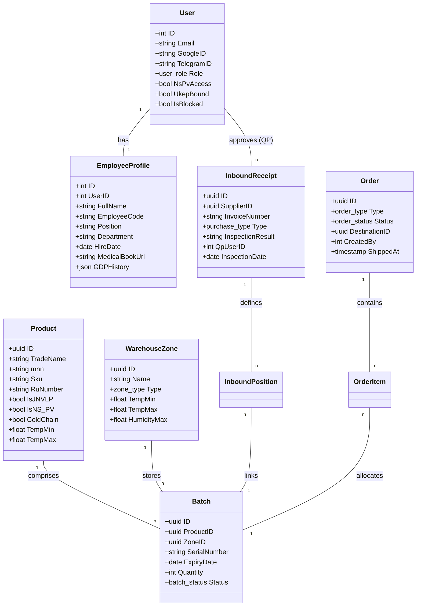

# System Architecture — Pharmaceutical ERP

← [Back to Main README](../../README.md) | [Algorithms →](algotirm.md) | [Workflow →](../other/workflow.md)

Данный документ описывает программную архитектуру, взаимосвязь модулей и структуру данных системы.

---

## 1. Дерево функций (Functional Tree)

Система разделена на административный, складской и общепользовательский функционал.

*   **Модуль «Аутентификация и Доступы»**
    *   Вход через Google OAuth 2.0
    *   Вход по Email (OTP 6-значный код)
    *   Управление сессиями (Refresh Tokens)
    *   Разграничение ролей (Admin, QP, Manager, Storekeeper, Pharmacist)
*   **Модуль «Персонал»**
    *   Управление профилями сотрудников (Медкнижки, допуски)
    *   Учет обучения GDP (Good Distribution Practice)
*   **Модуль «Каталог товаров»**
    *   Реестр лекарственных средств (МНН, АТХ-коды, ЖНВЛП)
    *   Учет весогабаритных характеристик и температурных режимов
    *   Управление фото-контентом
*   **Модуль «Складской учет»**
    *   **Приемка (Inbound):** Создание накладных, перемещение в карантин.
    *   **Контроль качества (QP):** Акцепт или отбраковка серий.
    *   **Зонирование:** Размещение по спец-зонам (Холод, НС/ПВ, Сейф).
    *   **Журнал среды:** Фиксация температуры и влажности по сменам.
*   **Модуль «Заказы и Отгрузка»**
    *   Создание заказов (Regular/CITO)
    *   Автоподбор серий по **FEFO**
    *   Сборка и генерация ТТН (Товарно-транспортная накладная)
*   **Модуль «Рекламации и Регуляторика»**
    *   Учет брака и возвратов (Рекламации)
    *   Мониторинг STOP-сигналов Росздравнадзора (Recalls)
*   **Модуль «Инвентаризация»**
    *   Создание сессий инвентаризации (слепой пересчет)
    *   Анализ расхождений и акты списания/оприходования

---

## 2. Диаграмма взаимосвязи модулей (Next.js ↔ Go)

Система использует современный стек: **Go (Backend)** и **Next.js (Frontend)**.

```mermaid
graph LR
    subgraph "Frontend (Next.js 16)"
        A[Client Components] -- "Interaction" --> B[React State/Zod]
        C[Server Components] -- "Initial Data" --> D[Next.js Fetch Cache]
    end

    subgraph "Communication"
        API[REST API / JSON]
        Auth[JWT + HttpOnly Cookie]
    end

    subgraph "Backend (Go 1.22+)"
        H[Chi Router / Middleware] --> S[Service Layer (Business Logic)]
        S --> R[Repository Layer (GORM/PostgreSQL)]
        S --> V[Valkey Cache (OTP/Rate Limit)]
    end

    A <--> API
    C <--> API
    B <--> Auth
```

### Ключевые принципы взаимодействия:
1.  **Stateless API:** Бэкенд не хранит состояние сессии в памяти, используя JWT и PostgreSQL/Valkey.
2.  **Onion Architecture (Go):** Четкое разделение на Domain, Service, Repository и Handler.
3.  **App Router (Next.js):** Использование серверных компонентов для ускорения рендеринга и SEO, и клиентских для интерактивных форм.
4.  **Shared DTO:** Структуры данных на Go (Backend) соответствуют TypeScript-интерфейсам (Frontend).

---

## 3. Схема данных и взаимосвязь классов (Entities)

Ниже представлена детальная структура основных сущностей системы и их атрибутов.



### Описание ключевых атрибутов сущностей:

*   **User (Пользователь)**: Базовая сущность для аутентификации. `NsPvAccess` определяет допуск к сильнодействующим веществам, `UkepBound` — привязку электронной подписи.
*   **EmployeeProfile (Профиль сотрудника)**: Хранит кадровые данные. `GDPHistory` — JSON-массив с историей ежегодных обучений надлежащей практике распределения.
*   **Product (Товар)**: Карточка лекарственного средства. Включает требования по хранению (`TempMin`/`Max`) и регуляторные флаги (`IsJNVLP` — ЖНВЛП, `IsNS_PV` — ПКУ).
*   **Batch (Серия)**: Партия конкретного товара на складе. Ключевые поля: `ExpiryDate` (срок годности для FEFO) и `Status` (контроль доступности).
*   **InboundReceipt (Приемка)**: Документ поступления. Связывает поставщика и принятые серии. Содержит результаты контроля `QP` (Уполномоченного лица).
*   **Order (Заказ)**: Документ отгрузки. Содержит статус жизненного цикла заказа и ссылки на ответственных за сборку и отгрузку.
*   **WarehouseZone (Зона склада)**: Физическое или логическое место хранения с заданными параметрами микроклимата (`TempMin`, `TempMax`, `HumidityMax`).

---

## 4. Схема инфраструктуры (Deployment)

*   **Reverse Proxy:** Nginx (Proxy pass к Next.js и Go API)
*   **Database:** PostgreSQL 16
*   **Caching:** Valkey 7.x (for OTP and Rate-limiting)
*   **Storage:** S3-compatible (for Photos and PDF Scans)

---

## 5. Архитектурные решения (ADR)

> Данный раздел фиксирует нетривиальные проектные решения, принятые в ходе разработки. Изменять без явного обоснования не следует.

---

### ADR-001: Топология «1 склад → N аптек»

**Контекст:**
Система управляет **одним** физическим складом, разбитым на логические зоны (`warehouse_zones`). Заказы (`orders`) отправляются в аптеки-получатели, идентифицируемые полем `destination_id UUID`.

**Решение:**
Складской учёт (остатки, FEFO, ROP, MOS) ведётся глобально по всему складу, без разбивки per-аптека. `destination_id` — это атрибут документа отгрузки, а не единица управления запасами.

**Следствия:**
- Таблицы `pharmacies` / `warehouses` в схеме не нужны на данном этапе.
- `GetMonthlyTurnover(productID)` суммирует **все** заказы по продукту независимо от аптеки-получателя — это корректно, т.к. это суммарный спрос с единого склада.
- ROP, MOS, Safety Stock — всё в разрезе «продукт × склад», а не «продукт × аптека».
- При масштабировании до multi-warehouse потребуется выделить таблицу `warehouse_stocks(warehouse_id, product_id, qty)` — сейчас это не нужно.

---

### ADR-002: Поля ROP/MOS хранятся в таблице `products`, а не в отдельной таблице

**Контекст:**
Для расчёта точки перезаказа (ROP) нужны три параметра: `lead_time_days`, `safety_stock_qty`, `max_stock_qty`.

**Альтернативы рассмотренные:**
1. Отдельная таблица `product_reorder_params(product_id, lead_time_days, ...)` — избыточно, adds join.
2. Таблица `supplier_products(supplier_id, product_id, lead_time_days)` — корректнее семантически, но в схеме нет таблицы `supplier_products` и нет привязки «поставщик по умолчанию» к продукту.
3. Колонки прямо в `products` — **выбрано**.

**Решение:**
Добавить в `products` (migration #18):
```sql
lead_time_days   INT NOT NULL DEFAULT 14,   -- срок поставки (дней)
safety_stock_qty INT NOT NULL DEFAULT 0,    -- страховой запас (шт.)
max_stock_qty    INT NOT NULL DEFAULT 1000  -- целевой максимальный запас (шт.)
```

**Обоснование:**
- Склад один — глобальные нормативы per-product достаточны.
- Не усложняет запросы (не нужен JOIN).
- Значения редко меняются — хранить рядом с карточкой товара логично.
- При переходе к multi-supplier потребуется выделить `supplier_products` с override полей — это эволюция, а не ошибка.

---

### ADR-003: VEN-категория — PostgreSQL ENUM `ven_category`

**Контекст:**
В документации описан VEN-анализ (Vital / Essential / Non-essential). В исходной схеме нет поля `ven_category` — только `is_jnvlp BOOLEAN`.

**Решение:**
Добавить PostgreSQL ENUM и колонку (migration #18):
```sql
CREATE TYPE ven_category AS ENUM ('V', 'E', 'N');
ALTER TABLE products ADD COLUMN ven_category ven_category NOT NULL DEFAULT 'N';
```

**Почему не `is_jnvlp` как прокси для V:**
`is_jnvlp` (ЖНВЛП) — регуляторный флаг ценового контроля, не всегда совпадает с VEN-V. Препарат может быть ЖНВЛП и относиться к категории E. Смешивать понятия — нарушение бизнес-логики.

**Связь VEN с Safety Stock:**
`safety_stock_qty` задаётся вручную менеджером. Система только блокирует regular-отгрузку если `ven_category = 'V'` и `total_stock - requested_qty < safety_stock_qty`.

---

### ADR-004: Поля `type` и `product_id` добавляются в таблицу `claims` (migration #18)

**Контекст:**
Реальная таблица `claims` (migration #015) создавалась упрощённо: нет `type claim_type`, нет `product_id`. Схема в `docs/Diplom/migrate.md` описывала целевое состояние, но миграция не была обновлена.

**Решение:**
```sql
ALTER TABLE claims
    ADD COLUMN type       claim_type,       -- 'recall' | 'return_from_pharmacy' | ...
    ADD COLUMN product_id UUID REFERENCES products(id);
```

`type` — nullable на уровне SQL (старые записи), но обязателен в бизнес-логике при создании через API.

**Cascade Block при recall:**
При `CreateClaim` с `type = 'recall'` сервис вызывает `BatchRepository.BlockAllByProductID(ctx, productID)` — устанавливает `status = 'blocked'` всем `available`-сериям данного продукта.

---

### ADR-005: `order_type` добавляется в `orders`, `batch_id` и `mos_blocked` — в `order_items` (migration #18)

**Контекст:**
FEFO-алгоритм требует знать тип заказа (regular/cito) для VEN/MOS-проверок. ENUM `order_type` уже создан в migration #001.

**Решение:**
```sql
ALTER TABLE orders     ADD COLUMN order_type  order_type NOT NULL DEFAULT 'regular';
ALTER TABLE order_items ADD COLUMN batch_id    UUID REFERENCES batches(id);
ALTER TABLE order_items ADD COLUMN mos_blocked BOOLEAN NOT NULL DEFAULT false;
```

`batch_id` заполняется сервисом автоматически при выполнении FEFO-алгоритма в `CreateOrder`.  
`mos_blocked = true` — маркер, не блокирует заказ, но сигнализирует менеджеру о критическом уровне запаса.

---

### ADR-006: Нотификации — DEFERRED

Система уведомлений (пропущенные логи, низкий запас, нарушение температуры) отложена до отдельного решения. При нарушении температуры зоны на данном этапе возвращается `ErrZoneTempViolation` — фронт отображает предупреждение пользователю.

---

### ADR-007: Netting Act группируется по первым 3 символам ATC-кода

**Контекст:**
В документации: «зачёт допускается в рамках одной ценовой группы». Поля `price_group` в `inventory_items` нет.

**Решение:**
Группировка по `product.atc_code[:3]` — первые 3 символа ATC означают терапевтическую подгруппу, что семантически близко к ценовой группе в фармацевтике.
Если `atc_code` пуст — позиция группируется отдельно (группа `"---"`).

---

### ADR-008: GDP-валидация — утилитарная функция, не middleware

**Контекст:**
GDP-проверка нужна в нескольких точках (EnvLog, Inbound, Inventory). Middleware на route уровне потребовало бы загрузки профиля на каждый запрос.

**Решение:**
Экспортируемая функция `service.CheckGDPValid(profile *domain.EmployeeProfile) error` вызывается в сервисах явно, только там где нужна. Сервисы получают `profileRepo` как зависимость.
