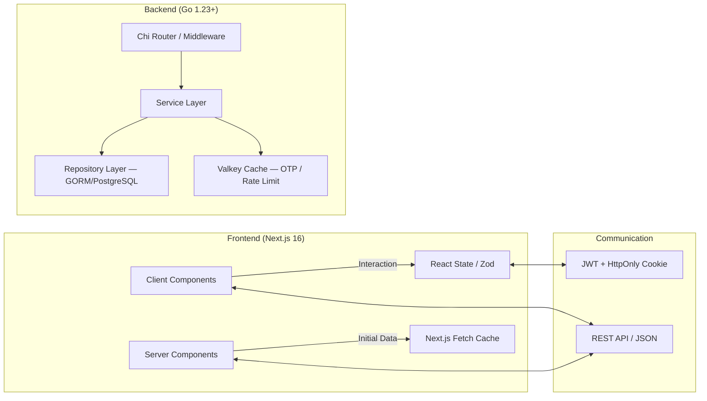

# Backend — Architecture & Onion Layers

← [Back to Main README](../../README.md) | [Setup & Local Run →](./README.md)

---

## Onion Architecture

The backend is split into 4 concentric layers. Dependencies flow **inward only**: handlers depend on services, services depend on repositories via domain interfaces, and the domain core depends on nothing.

```
┌──────────────────────────────────────────────────────────────┐
│  Handler  (internal/handler)                                  │
│   HTTP handlers, request/response DTOs, middleware            │
│                                                               │
│  ┌────────────────────────────────────────────────────────┐   │
│  │  Service  (internal/service)                           │   │
│  │   Business logic, repository orchestration             │   │
│  │                                                         │   │
│  │  ┌──────────────────────────────────────────────────┐  │   │
│  │  │  Repository  (internal/repository)               │  │   │
│  │  │   GORM implementations, DAO objects, SQL queries │  │   │
│  │  │                                                   │  │   │
│  │  │  ┌────────────────────────────────────────────┐  │  │   │
│  │  │  │  Domain  (internal/domain)                 │  │  │   │
│  │  │  │   Pure models, interfaces, errors          │  │  │   │
│  │  │  └────────────────────────────────────────────┘  │  │   │
│  │  └──────────────────────────────────────────────────┘  │   │
│  └────────────────────────────────────────────────────────┘   │
└──────────────────────────────────────────────────────────────┘
```

### Layer Reference

| Layer | Package | Tags | Responsibility |
|-------|---------|------|----------------|
| **Handler (HTTP)** | `internal/handler` | — | Parse request, validate, call service |
| **DTO** | `internal/handler/dto` | `json`, `validate` | API request/response shapes |
| **Domain** | `internal/domain` | *(none)* | Pure Go structs, business interfaces |
| **Service** | `internal/service` | — | Business logic, orchestration |
| **Repository** | `internal/repository` | — | Interface implementations |
| **DAO** | `internal/repository/dao` | `gorm` | DB table mirrors for GORM |

> **Rule:** Domain models know nothing about JSON or GORM. All tags live exclusively in DTO or DAO layers.

---

## Dependency Injection

All layers communicate through **interfaces** defined in `internal/domain`:

- `domain.UserRepository` — user data access
- `domain.SessionRepository` — refresh token / session management
- `domain.AuthService` — authentication business logic
- `domain.TokenService` — JWT creation and validation
- `domain.EmployeeProfileService` / `EmployeeProfileRepository` — employee profiles

Concrete implementations live in `repository/` and `service/`. This allows full mocking in tests.

---

## Entry Point (`cmd/main.go`)

Application starts in strict order:

1. **Logger** (`internal/pkg/logger`) — `slog.Logger` with request context enrichment
2. **Config** (`config.Load()`) — `cleanenv` reads `.env` → env vars → exits on missing required vars
3. **Graceful shutdown** — `signal.NotifyContext` catches `SIGINT` / `SIGTERM`
4. **Database** — `repository.NewPostgresDB()` → GORM + pgx
5. **Layers** — `Repository → Service → Handler` (manual dependency injection)
6. **HTTP Server** — `domain.Server` (wrapper over `net/http.Server`)
7. **Bootstrap** — `bootstrap.SeedAdmin()` creates the first admin user if not present

---

## System Architecture Diagram (Frontend ↔ Backend)



**Key principles:**
1. **Stateless API** — backend holds no in-memory session state; uses JWT + PostgreSQL/Valkey
2. **Onion Architecture** — strict layer separation (see above)
3. **App Router (Next.js)** — Server Components for initial data + SEO; Client Components for interactive forms
4. **Shared DTO** — Go backend structs correspond to TypeScript interfaces on the frontend
