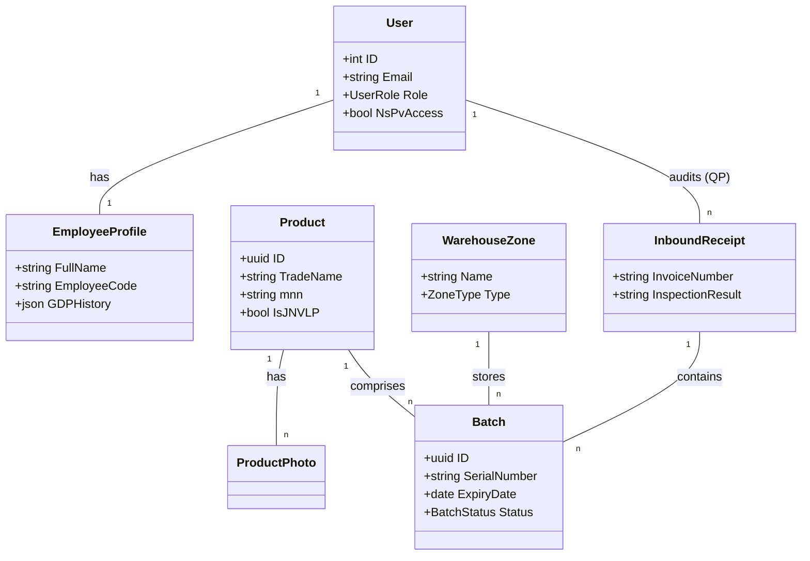

# Архитектура системы ERP (Фармацевтика)

Данный документ описывает программную архитектуру, взаимосвязь модулей и структуру данных системы.

---

## 1. Дерево функций (Functional Tree)

Система разделена на административный, складской и общепользовательский функционал.

*   **Модуль «Аутентификация и Доступы»**
    *   Вход через Google OAuth 2.0
    *   Вход по Email (OTP 6-значный код)
    *   Управление сессиями (Refresh Tokens)
    *   Разграничение ролей (Admin, QP, Manager, Storekeeper, Pharmacist)
*   **Модуль «Персонал»**
    *   Управление профилями сотрудников (Медкнижки, допуски)
    *   Учет обучения GDP (Good Distribution Practice)
*   **Модуль «Каталог товаров»**
    *   Реестр лекарственных средств (МНН, АТХ-коды, ЖНВЛП)
    *   Учет весогабаритных характеристик и температурных режимов
    *   Управление фото-контентом
*   **Модуль «Складской учет»**
    *   **Приемка (Inbound):** Создание накладных, перемещение в карантин.
    *   **Контроль качества (QP):** Акцепт или отбраковка серий.
    *   **Зонирование:** Размещение по спец-зонам (Холод, НС/ПВ, Сейф).
    *   **Журнал среды:** Фиксация температуры и влажности по сменам.
*   **Модуль «Заказы и Отгрузка»**
    *   Создание заказов (Regular/CITO)
    *   Автоподбор серий по **FEFO**
    *   Сборка и генерация ТТН (Товарно-транспортная накладная)
*   **Модуль «Рекламации и Регуляторика»**
    *   Учет брака и возвратов (Рекламации)
    *   Мониторинг STOP-сигналов Росздравнадзора (Recalls)
*   **Модуль «Инвентаризация»**
    *   Создание сессий инвентаризации (слепой пересчет)
    *   Анализ расхождений и акты списания/оприходования

---

## 2. Диаграмма взаимосвязи модулей (Next.js ↔ Go)

Система использует современный стек: **Go (Backend)** и **Next.js (Frontend)**.

```mermaid
graph LR
    subgraph "Frontend (Next.js 16)"
        A[Client Components] -- "Interaction" --> B[React State/Zod]
        C[Server Components] -- "Initial Data" --> D[Next.js Fetch Cache]
    end

    subgraph "Communication"
        API[REST API / JSON]
        Auth[JWT + HttpOnly Cookie]
    end

    subgraph "Backend (Go 1.22+)"
        H[Chi Router / Middleware] --> S[Service Layer (Business Logic)]
        S --> R[Repository Layer (GORM/PostgreSQL)]
        S --> V[Valkey Cache (OTP/Rate Limit)]
    end

    A <--> API
    C <--> API
    B <--> Auth
```

### Ключевые принципы взаимодействия:
1.  **Stateless API:** Бэкенд не хранит состояние сессии в памяти, используя JWT и PostgreSQL/Valkey.
2.  **Onion Architecture (Go):** Четкое разделение на Domain, Service, Repository и Handler.
3.  **App Router (Next.js):** Использование серверных компонентов для ускорения рендеринга и SEO, и клиентских для интерактивных форм.
4.  **Shared DTO:** Структуры данных на Go (Backend) соответствуют TypeScript-интерфейсам (Frontend).

---

## 3. Схема данных и взаимосвязь классов (Entities)

Основные сущности и их отношения (Class-level diagram).



---

## 4. Схема инфраструктуры (Deployment)

*   **Reverse Proxy:** Nginx (Proxy pass к Next.js и Go API)
*   **Database:** PostgreSQL 16
*   **Caching:** Valkey 7.x (for OTP and Rate-limiting)
*   **Storage:** S3-compatible (for Photos and PDF Scans)
